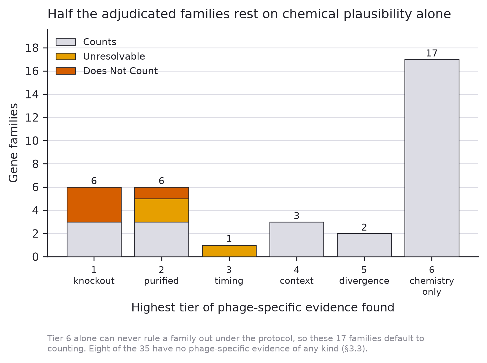
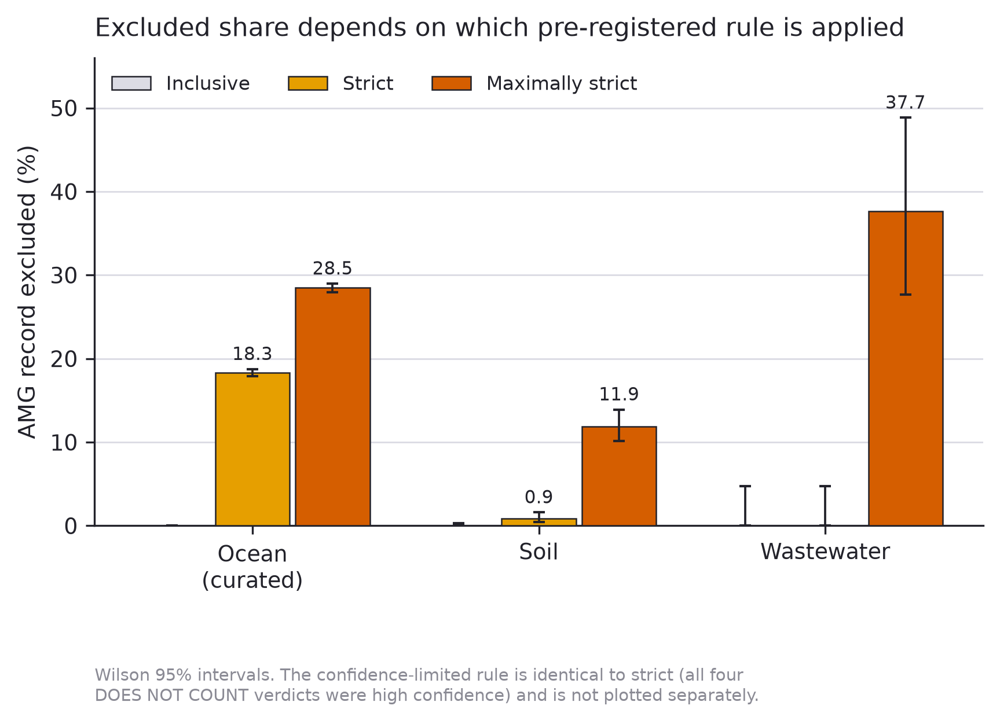
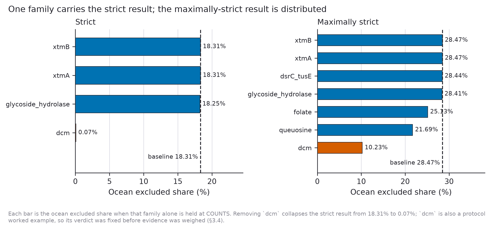
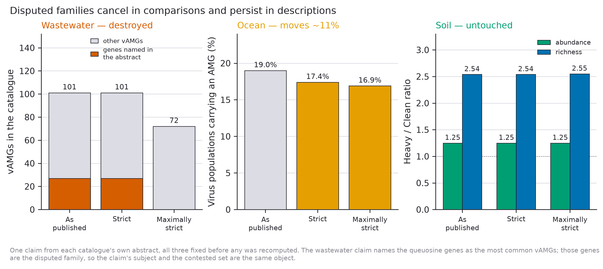

# Adjudicating the viral auxiliary metabolic gene record: disputed families cancel in comparisons and persist in descriptions

**Daniel Murphy**

*Independent researcher, United Kingdom*

Correspondence: daniel.s.murphy@outlook.com

**Data and code availability:** all analysis code, intermediate results, the pre-registered
protocol with amendments, the frozen accession list, the sealed abundance counts with their
commit history, and both adjudication passes are openly available. The version underlying this
manuscript is permanently archived at **doi:10.5281/zenodo.21876444**; development continues at
https://github.com/dmurfy06/amg-annotation-audit

**Competing interests:** none declared.

**Funding:** this work received no funding.

**Use of generative AI.** A large language model (Claude, Anthropic) was used to write the
analysis code, to conduct literature searches, and to produce a **first-pass adjudication of
all 35 gene families**, which the author then re-rated independently for the 12 families where
evidentiary judgement was required. The AI is not an author and made no decision about what to
report. All verdicts, all reported figures, and the interpretation are the author's. The
limitation this creates for the reliability of the adjudication is stated in full in §2.5 and
in the Limitations, and no inter-rater reliability statistic is claimed. All code and both
adjudication passes are public.

---

## Abstract

Viruses of bacteria carry genes that resemble host metabolic enzymes. These are routinely
catalogued as auxiliary metabolic genes (AMGs) and read as evidence that viruses reprogram
host metabolism. A 2025 *Nature Microbiology* review argued that several of the most frequently
counted categories are more plausibly performing viral functions — genome protection,
nucleotide provisioning, receptor modification — named specific suspects without quantifying
them, and proposed retiring "AMG" in favour of the broader "auxiliary viral gene" (AVG). We
quantify the suspects.

We harmonised three published AMG catalogues spanning ocean, soil and wastewater
(93,413 calls, three annotation pipelines, three independent research groups), matched gene
families by database accession rather than free text, and adjudicated 35 gene families
against a pre-registered two-part rule with a six-tier evidence hierarchy. The rule was
deliberately biased against our own hypothesis: families default to counting, and chemical
plausibility alone can never rule one out.

**Twenty-eight of 35 families survive adjudication**, so the record is not broadly
miscounted. Four are ruled out and three are unresolvable. **Eight of 35 have no
phage-specific experimental evidence of any kind**, yet support published claims.

Where the record is exposed, it is exposed narrowly. The families carrying that exposure are
**unresolvable rather than refuted** — the published evidence cannot decide them in either
direction — and they are, without exception, families the field had already named. Over the
30 families that entered this study genuinely blind, **the adjudication ruled out none**.
Under the strictest pre-registered rule the share of the record resting on families that
cannot currently be shown to support the inference drawn from them is **28.5% (curated ocean),
11.9% (soil) and 37.7% (wastewater)**; in the ocean the less strict rule reduces to a single
family (`dcm`, 99.6% of excluded calls).

One matching error is worth reporting on its own: **99.8% of ocean glycoside hydrolase calls
matched a Pfam entry describing a structural fold rather than an enzymatic activity**
(`PF13385`, Concanavalin A-like lectin), an artefact of text-based family assignment that
accession-based matching removes.

Testing the consequence on published claims, the effect is strongly claim-dependent. A
wastewater catalogue's headline compositional claim does not survive: the genes it names as
most common are the disputed family. An ocean prevalence estimate moves modestly (19% to
16.9%). A soil comparative claim across a contamination gradient is entirely unaffected.
**Disputed families cancel in comparisons and persist in descriptions.** Comparative AMG
claims are largely robust; the more specific a descriptive claim, the more of it rests on
families the current evidence cannot adjudicate.

Four limitations are stated rather than buried. These are three catalogues chosen by us, of
which the ocean supplies 95% of the calls, so every aggregate is substantially an ocean figure.
Abundance weighting is impossible for that same 95%, because the ocean catalogue publishes no
abundance table. Every family carrying the quantitative result was, by the protocol's advance
declaration, adjudicated with its abundance already publicly known. And the first adjudication
pass was AI-assisted, with the independence of the human second pass unverified; no inter-rater
reliability statistic is claimed.

None of the three catalogues did anything the field would regard as incorrect. They applied
the standard category. The problem is in the category — which is an argument for Martin
*et al.*'s proposed reframing, on narrower grounds than they give for it.

---

## 1. Introduction

Bacteriophages carry genes with unmistakable homology to bacterial metabolic enzymes. The
canonical example is `psbA`, encoding the photosystem II reaction centre protein D1. Mann
*et al.* (2003) found it in a cyanophage genome (doi:10.1038/424741a); Lindell *et al.* (2005)
showed the phage copy is transcribed during infection of *Prochlorococcus*, co-transcribed with
essential phage capsid genes, with phage D1 protein accumulating through the infective period
while host photosynthesis gene expression declines (doi:10.1038/nature04111); and Sullivan
*et al.* (2006) found `psbA` in 88% of surveyed cyanophage genomes, and both `psbA` and `psbD`
in 50% (doi:10.1371/journal.pbio.0040234). Such genes are interpreted as **auxiliary metabolic
genes**: virus-encoded functions that sustain or redirect host metabolism through infection,
with consequences that scale to biogeochemical cycling.

For `psbA` the interpretation is well supported — and the standard of evidence behind it is
worth stating, because very little else in the record meets it: expression measured across
infection, protein quantified, and phage genome replication shown to depend on photosynthesis.
A phage that keeps photosynthesis running in a cell it is consuming is doing something the host
would recognise as its own metabolism, and the fitness rationale — maintaining the energy supply
the phage is drawing on — is clear. `psbA` and `psbD` serve as this study's positive controls
for precisely that reason.

The inference has since been generalised well beyond that case. Annotation pipelines assign
AMG status semi-automatically; catalogues are published at the scale of tens of thousands of
calls; and those counts underwrite claims about viral contributions to carbon, nitrogen,
sulfur and phosphorus cycling across every sampled environment. The category has become
infrastructure.

Martin *et al.* (2025, *Nature Microbiology*, doi:10.1038/s41564-025-02095-4) argue that a
substantial part of what the infrastructure has accumulated is misread. Several of the most
frequently counted families have direct, well-documented viral functions:

- **DNA cytosine methyltransferases** (`dcm`) modify the phage's own genome, evading host
  restriction — genome protection, not host metabolism.
- **Queuosine biosynthesis** enzymes make 7-deazaguanine derivatives that have been detected
  *in phage DNA*, where the attributed function is protection from host endonucleases
  (Thiaville *et al.* 2016, doi:10.1073/pnas.1518570113; Hutinet *et al.* 2016,
  doi:10.1080/15476286.2016.1265200).
- **Glycoside hydrolases** include virion-associated lysins that breach the cell wall during
  entry; one was found bound to the phage baseplate and proposed to facilitate genome
  injection (Yuan & Gao 2016, doi:10.3389/fmicb.2016.00745).
- **Folate and one-carbon** enzymes feed nucleotide biosynthesis, which during infection is
  supplying the phage genome.

The general form of the objection is that a gene can act on a host molecule and still be
performing a discrete step of the viral lifecycle rather than sustaining host metabolism —
and that the AMG category, as applied, does not distinguish the two.

Their proposed remedy is terminological: retire "auxiliary metabolic gene" in favour of
**"auxiliary viral gene" (AVG)**, an expanded category covering all genes auxiliary to core
viral functions, together with an eco-evolutionary framework for the analyses needed to support
claims made about them. The rename is motivated by the misannotation problem, but its scope is
the whole category.

Martin *et al.* name the suspects. They do not count them — so how much of the record the
rename is needed *for* is unknown, and that is a question their own argument cannot answer.

The concern is not new. Pratama *et al.* (2021, doi:10.7717/peerj.11447) benchmarked viromics
workflows, showed that fragmented assemblies lead to **erroneous identification of AMGs**, and
set out a best-practice workflow for curating candidate AMGs. But that work addresses how to
curate a candidate correctly going forward; it does not quantify how much of the
already-published record rests on families whose interpretation is contested. **That has never
been measured.**

That is the gap. It matters because the answer is not obvious in either direction: the
contested families could be a rounding error, or they could be most of the record, and the
published literature is compatible with both. It also matters that the question is answerable
without new experiments — the catalogues, the annotations and the primary phage literature
are all public.

This study asks three questions in order:

1. **How much of the published record sits in contested families?** We harmonise three
   independent catalogues and match families by database accession rather than free text
   (§2.2, §3.1).
2. **Do the catalogues apply their own stated inclusion criteria?** This is deliberately
   independent of Martin *et al.*'s rubric, and so cannot be dismissed as choosing a
   convenient standard (§3.2).
3. **Which families withstand scrutiny on the published evidence, and does removing the rest
   change anything anyone has claimed?** (§3.3–3.6).

The third question is the one that determines whether any of this matters. A labelling
problem that changes no published conclusion is a curiosity; one that changes conclusions
selectively, in a predictable direction, is a methodological finding. We find the latter.

> **A note on what this study is and is not.** Every verdict here is a judgement about the
> most parsimonious reading of a gene *family* on currently published evidence. It is
> defeasible, it is not a claim about any individual gene call, and it is not a claim that
> anyone's annotation is incorrect. The protocol was pre-registered, deliberately biased
> against the hypothesis motivating the study, and its abundance data sealed before any
> verdict existed, precisely because the author had an obvious interest in a particular
> answer.

---

## 2. Methods

### 2.1 Catalogues

Three published AMG catalogues, chosen for independence of environment, pipeline and
research group:

| Catalogue | Environment | Pipeline | Calls | KO-assigned |
|---|---|---|---|---|
| Microbiome 2024 | Global ocean (*Tara*) | DRAM-v | 88,729 | 31,772 |
| ISME J 2022 | Soil, organochlorine gradient | VIBRANT + DRAM-v | 4,583 | 1,151 |
| ES&T 2023 | Wastewater activated sludge | kofamscan + hmmsearch | 101 | 77 |

The ocean catalogue is additionally available pre-curation (255,859 calls), which permits a
direct test of whether curation enriches or depletes contested families.

> **Reconciliation with the published count.** Tian *et al.* report **86,913** AMGs; our
> harmonised table holds **88,729 ocean rows**. These agree exactly: the table carries
> **86,913 distinct gene identifiers**, and the 1,816 surplus rows are genes bearing more than
> one annotation. We count *calls* (rows) by default because that is what a catalogue's
> composition is made of, and report per-gene figures alongside wherever the two differ
> materially. Recovering the published figure to the digit is the check that the harmonisation
> is faithful.

### 2.2 Accession-based family matching (Amendment 1)

Gene families were initially identified by text-matching annotation descriptions. **This was
wrong and the results it produced are void.** Databases spell the same function differently
("glycosyltransferase" vs "Glycosyl transferases group 1"), so text matching under-counted
by up to ninefold in the soil catalogue.

All matching is now by **database accession** (KEGG KO, Pfam PF), which cannot be misspelled.
The frozen accession list is `data/family_accessions.tsv`. Every accession was reviewed by
hand and carries a status:

- **INCLUDED** (72) — the accession denotes the family's activity.
- **AMBIGUOUS** (6) — `folE`, `folE2`, `queD` and relatives sit at the branch point shared by
  folate and queuosine biosynthesis. Reported both ways throughout; this single ambiguity
  moves the wastewater result by 18 percentage points.
- **EXCLUDED** (2) — matched in error and removed.

The two exclusions matter enough to state explicitly:

- **`PF13385`** — "Concanavalin A-like lectin/glucanases superfamily" — is a **structural
  fold, not an activity**. Concanavalin A binds sugars; it does not hydrolyse them. It was
  matched solely on the substring "glucanases", and it was **9,237 of the 9,258 glycoside
  hydrolase calls in the curated ocean catalogue (99.8%)** — 21,567 of 21,690 (99.4%) if the
  pre-curation ocean release is counted alongside the curated one, as the frozen accession
  table does.
- **`K14652`** (`ribBA`) is GTP cyclohydrolase **II** — riboflavin biosynthesis. Folate and
  queuosine use GTP cyclohydrolase **I**. Matched on the shared string "GTP cyclohydrolase".

Both errors inflated our own hypothesis. Removing them reduced the headline. We report this
because the direction is informative: the largest single correction in this study made the
result smaller.

### 2.3 The adjudication rule (pre-registered)

Full protocol: `08_adjudication_protocol.md`, committed before any verdict existed.

A family **counts** as an AMG only if **both**:

1. **Substrate** — the gene product acts on a **host** molecule; and
2. **Consequence** — the effect is to **sustain or redirect host metabolism**, rather than to
   serve a discrete step of the viral lifecycle (entry, genome protection, replication,
   assembly, egress).

Three design choices deliberately bias the protocol *against* the hypothesis this study
exists to test:

- **The default verdict is COUNTS.** A family leaves the record only on positive evidence.
- **Tier 6 evidence (chemical plausibility alone) can never rule a family out.** Tier 6 is
  essentially what Martin *et al.* offer; permitting it to decide would restate their argument
  rather than test it.
- **UNRESOLVABLE requires naming the experiment that would settle it.** A family with no
  evidence at all is *unresearched*, not unresolvable, and defaults to COUNTS. Collapsing
  those two states would inflate the excluded share on the basis of nobody having done an
  experiment — the exact information loss this paper criticises.

**Evidence tiers.** 1: gene knocked out of a phage and effect measured. 2: the phage's own
protein purified or structured and substrate shown. 3: expression timing across infection.
4: consistent genomic context among structural/replication genes. 5: informative divergence
from host copies. 6: chemistry alone.

**Family selection.** A family was adjudicated if it accounted for ≥1% of KO-assigned AMG
calls *and* ≥10 calls in any catalogue, or was named by Martin *et al.* The ≥10 floor
(Amendment 2) prevents the percentage threshold from becoming degenerate in the 77-call
wastewater catalogue; it removes 18 families accounting for 3.1 percentage points, which are
counted in aggregate as COUNTS. No control was removed by this amendment.

**Controls.** Four families are designated controls: `psbA`/`psbD` (positive) must return
COUNTS, and `xtmA`/`xtmB` (negative) must return DOES NOT COUNT. All four returned correctly.
`dcm` is not a control but a **worked example** — the protocol's own table of the rule's
behaviour states its verdict in advance — so its result is also pre-specified, and we treat it
as such throughout. **None of these are blind**: the protocol names them all. They test whether
the rule, faithfully applied, reproduces distinctions the field already accepts. They do not
test rater impartiality, and we do not claim they do.

**Sealed counts, and what the seal does not cover.** Per-family abundance was computed and
committed to `data/adjudication_counts_SEALED.tsv` before any verdict existed, and opened only
after all 35 verdicts were recorded and the controls checked.

The seal is not blanket blinding, and the protocol says so explicitly. **Five families —
`dcm`, `queuosine`, `glycoside_hydrolase`, `folate` and `dsrC_tusE` — were named by Martin
*et al.*, so their approximate abundance was public knowledge before this study began and could
not be unknown.** The protocol labels these *seen*, declares their verdicts "protocol-guided
but not blind", and commits to reporting the excluded share twice: over all families, and over
blind-only families. That analysis is §3.7, and it matters more than we expected.

For the 30 blind families, no verdict can have been fitted to counts the rater did not have.

### 2.4 Reporting rules (pre-registered)

The excluded share is reported under four rules, always together:

| Rule | Treatment |
|---|---|
| **Inclusive** | Current field practice; nothing excluded |
| **Strict** | DOES NOT COUNT excluded; UNRESOLVABLE retained |
| **Maximally strict** | DOES NOT COUNT *and* UNRESOLVABLE excluded |
| **Confidence-limited** | Only high-confidence DOES NOT COUNT excluded |

All proportions carry Wilson score intervals. The spread between rules is a headline result,
not a footnote: no reader has to accept our verdicts to use our numbers.

### 2.5 Rater independence — a limitation stated in the methods, not the discussion

The first adjudication pass was produced with AI assistance (Claude, Anthropic). A second
pass was then conducted by the author on the 12 families where evidentiary judgement was
actually required; the remaining 23 were resolved mechanically by the protocol (no Tier 1–5
evidence exists, so the family cannot be ruled out), where two raters must agree by
construction and measuring agreement would inflate the figure while testing nothing.

The second pass worked from evidence extracts with all verdicts, tier assessments and
resolving experiments programmatically removed (build script and leak checks:
`scripts/build_blind_concordance_sheet.py`).

The second pass reproduced every verdict of the first, and agreed on confidence throughout. It
disagreed on the evidence tier for one family, `rfbC`, where the first pass assigned Tier 2 on
the strength of literature concerning O-antigen *transfer* enzymes and the second assigned
Tier 6, on the grounds that `rfbC` makes a precursor rather than performing the transfer. The
second reading is better, and the verdict is unchanged either way.

**No agreement statistic is reported, and none should be inferred.** Independence could not be
verified: the first-pass file remained accessible to the second rater during rating, contrary
to protocol. Text-similarity analysis does not indicate copying — every content word in the
second rater's free text appears in the supplied evidence extracts, which is sufficient to
explain the overlap, and the `rfbC` disagreement is not consistent with transcription. But
"probably independent" does not support a reliability coefficient, and quoting a proportion
here would invite exactly the unearned precision this paper criticises elsewhere. A genuine
inter-rater reliability figure requires a second human rater working from the blind materials
alone, and we did not obtain one. The full comparison, family by family, is in
`results/chunk5_concordance.md` for anyone who wants to judge it themselves.

---

## 3. Results

### 3.1 Two checks before any adjudication: assembly quality, and which namespace you count in

Pratama *et al.* (2021) showed that fragmented assemblies produce erroneous AMG identifications,
which makes assembly quality the first thing to check before any of what follows means anything.

68% of `dcm` calls — the largest contested family — carry DRAM-v's `F` flag. We established
from the DRAM-v source (`annotate_vgfs.py::get_metabolic_flags`, `length_from_end=5000`) that
`F` means *the gene lies within 5,000 bp of a contig end*: a positional property, not a
biological one, and exactly the marker of fragmented assembly Pratama *et al.* warn about.

The obvious objection follows immediately — that contested families are assembly artefacts.
They are not.

| Stratum | n | % F-flagged [95% CI] |
|---|---|---|
| **Baseline — all AMG calls** | 88,729 | **79.1% [78.9–79.4]** |
| Baseline — KO-assigned only | 31,772 | 75.8% [75.3–76.3] |
| `dcm` | 5,797 | 68.0% [66.8–69.2] |
| Queuosine biosynthesis | 2,156 | 74.8% [72.9–76.6] |
| **All contested families combined** | 7,969 | **69.9% [68.8–70.9]** |

Contested families are **better** placed than the catalogue average, with non-overlapping
intervals. A proportion without its denominator is not a finding; computing the baseline
converted a threat into a ruled-out confounder.

Two further flags are worth reporting: `V` (viral replication/structure category) and `T`
(transposon) occur **zero times** in the curated catalogue, confirming the published
exclusions were applied.

**The second check: the answer depends on which naming system you count in, and it flips.**
Every catalogue here can be matched in two independent namespaces — KEGG orthology (KO) and
Pfam — because the annotations carry both. They do not agree, and the disagreement is not a
constant offset:

| Catalogue | KO, per call | Pfam, per call | Ratio |
|---|---|---|---|
| Ocean (curated) | **21.35%** [20.90–21.80] | 7.78% [7.60–7.96] | KO **2.7×** higher |
| Soil | 8.69% [7.20–10.46] | **29.13%** [27.83–30.47] | Pfam **3.4×** higher |

These are the same calls, the same rubric, and the same contested families — counted through
two databases. **The ocean catalogue looks worst in KEGG and unremarkable in Pfam; soil is the
exact reverse.** So it is not that one namespace systematically inflates: different environments
carry different contested families, and each family is better described in a different database.
Ocean is dominated by `dcm`, which has a strong Pfam signature but an even stronger KO one;
soil is dominated by glycosyltransferases, which Pfam describes richly and KEGG barely.

The practical consequence is that **a published AMG proportion is uninterpretable without its
namespace and its unit**, and we have not found a paper that states both. Every figure in this
study is reported in KO space, per call, with the per-gene figures alongside wherever they
differ materially (§2.1).

### 3.2 The catalogues mostly cannot break their own rules

We tested each catalogue against **its own stated inclusion criteria**, using its own
annotation database. Martin *et al.* are not used in this analysis at all. This defeats the
objection that we simply selected a rubric that produces the answer we wanted.

**Ocean — the rule is enforceable, and enforced.** The catalogue states it excludes AMGs on
contigs carrying lipopolysaccharide-island genes including glycosyltransferases. Between the
permissive and conservative releases, glycosyltransferase calls fall from **30,483 to 2**
(99.993% removed) and all 762 transposon-flagged calls are removed. This is a **negative
result** for our pre-registered hypothesis, and it is what makes the positive result credible:
the test can pass.

**Wastewater — the rule cannot be applied deterministically.** The catalogue states that genes
"directly involved in viral replication (e.g., replication, repair, nucleotide transport, and
metabolism) were not included". Using the authors' own KEGG annotation, **13.0% [7.2–22.3] of
KO-assigned calls sit in a category the rule excludes** — but **0.0% [0.0–4.8] sit in such a
category exclusively.** Every one is dual-classified: `purA` is both nucleotide metabolism
(excluded) and amino acid metabolism (permitted); `prsA` is both nucleotide (excluded) and
carbohydrate metabolism (permitted), and the authors present it as a carbon gene.

A rule that does not decide is not being enforced. It is being interpreted case by case,
invisibly, and no reader can reconstruct which reading was applied to which gene.

**Soil — the rule is not mechanically testable.** "Proteins involved in nutrient
transformation and pollutant degradation were defined as auxiliary metabolic genes" is a
positive definition in ordinary English. Deciding whether cell-surface polysaccharide
biosynthesis counts as "nutrient transformation" requires our judgement, so this is not an
internal-inconsistency result and we do not claim it as one.

> **A pre-registered prediction that failed.** We predicted the queuosine genes would violate
> the wastewater rule, since the authors themselves note those genes "could also participate
> in tRNA biogenesis". They do not trip the test: KEGG files queuosine biosynthesis under
> **folate biosynthesis (09108, cofactors and vitamins)**, not nucleotide metabolism. The genes
> that trip it are `purA` and `prsA`, and neither trips it cleanly. Reported as a failed
> prediction rather than quietly dropped.

**So: of three catalogues, one states a rule it can and does enforce, one states a rule that
cannot be enforced, and one states no mechanically testable rule at all.** AMG inclusion
criteria are mostly not the kind of thing anyone can check — which is precisely why the
record drifts.

### 3.3 Adjudication: most families survive

Of 35 families adjudicated:

| Verdict | n | Families |
|---|---|---|
| **COUNTS** | 28 | incl. `psbA`, `psbD`, `phoH`, `TALDO1`, `nrdH`, `dut`, `NAMPT`, all nucleotide-sugar precursors |
| **DOES NOT COUNT** | 4 | `dcm`, `glycoside_hydrolase`, `xtmA`, `xtmB` |
| **UNRESOLVABLE** | 3 | `dsrC_tusE`, `folate`, `queuosine` |

**The headline finding is not that the record is full of miscounted genes.** Four families in
35 are ruled out, three of which are protocol controls or near-zero in abundance. The
adjudication mostly *vindicates* the field's assignments at the family level.

**Eight of the 35 families have no phage-specific experimental evidence of any kind.** Nobody
has tested what the phage version of those genes does, in any system. Published claims rest
on them regardless. This is independent of any verdict and, we suggest, the most immediately
actionable result here: it is a research agenda, not a criticism.

**Figure 1 — Half the adjudicated families rest on chemical plausibility alone.** Highest tier
of phage-specific evidence found for each of the 35 families, stacked by verdict. Seventeen
families reach only Tier 6, where the protocol forbids ruling a family out, so they default to
counting. Eight have no phage-specific evidence of any kind. Tiers are from the first-pass
record; the second pass disagreed on one family (`rfbC`, Tier 2 vs 6; §2.5).

`dsrC_tusE` deserves specific mention because it is an annotation failure rather than a
biological one. KEGG merges two functionally distinct proteins into one orthology group
literally named `tusE, dsrC` — one feeds tRNA thiolation, the other dissimilatory sulfite
reduction. Nothing in environmental data distinguishes them. The field's strongest
phage-sulfur paper writes `dsrC/tusE`, with a slash, inheriting the ambiguity in its own
notation.

### 3.4 The excluded share, and what carries it

| Rule | Ocean (curated) | Soil | Wastewater |
|---|---|---|---|
| Inclusive | 0% | 0% | 0% |
| **Strict** | **18.31% [17.89–18.74]** | 0.87% [0.47–1.59] | 0.00% [0.00–4.75] |
| **Maximally strict** | **28.47% [27.98–28.97]** | 11.90% [10.16–13.90] | **37.66% [27.67–48.83]** |
| Confidence-limited | 18.31% | 0.87% | 0.00% |

**Figure 2 — Excluded share depends on which pre-registered rule is applied.** Excluded share
of the KO-assigned AMG record under three of the four pre-registered rules, for each catalogue,
with Wilson 95% intervals. The confidence-limited rule is identical to strict — all four DOES
NOT COUNT verdicts were recorded at high confidence — and is not plotted separately. *The
spread between rules is the result; no single bar is the headline.*

Two features of this table matter more than the point estimates.

**The confidence-limited rule is degenerate.** All four DOES NOT COUNT verdicts were recorded
at high confidence, making it identical to strict. A pre-registered analysis that turns out
degenerate is still reported; its degeneracy is a fact about the evidence base.

**The ocean strict result is one gene family.** `dcm` supplies **5,797 of 5,818 excluded ocean
calls (99.6%)**. Leave-one-out across all 35 families:

| Family held as COUNTS | Ocean strict becomes | Swing |
|---|---|---|
| `dcm` | **0.07%** | **18.25 pp** |
| `glycoside_hydrolase` | 18.25% | 0.07 pp |
| `xtmA`, `xtmB` | 18.31% | 0.00 pp |

**Figure 3 — One family carries the strict result; the maximally-strict result is distributed.**
Leave-one-out for the ocean catalogue: each bar is the excluded share when that family alone is
held at COUNTS, against the dashed baseline. Under the strict rule, removing `dcm` collapses the
result from 18.31% to 0.07%. Under the maximally-strict rule the load is distributed across
`dcm`, `queuosine` and `folate`. `dcm` is highlighted because it is also a protocol worked
example, so its verdict was fixed before evidence was weighed.

Removing `dcm` collapses the strict result from 18.31% to 0.07%. Moreover, `dcm` is one of the
protocol's pre-specified worked examples: its verdict was fixed when the rules were written,
not when the evidence was weighed. **The ocean strict figure is therefore not an output of the
adjudication in the way the maximally-strict figure is**, and we do not present it as one.

The defensible headline is the maximally-strict row, where the load is distributed — `dcm`
18.25 pp, `queuosine` 6.79 pp, `folate` 3.35 pp — and where the families doing the work are
**unresolvable rather than refuted**. The honest statement of this study's central result is:

> The exposed portion of the AMG record is not material shown to be wrong. It is material the
> current evidence base cannot adjudicate in either direction — which is a statement about how
> thin the evidence is, not about how careless the field has been.

### 3.5 Abundance weighting covers only 5% of the record

The pre-registration commits to reporting call-weighted and abundance-weighted shares wherever
per-sample abundance exists. It exists for soil (9 samples, relative abundance) and wastewater
(RPKM per genome). **It does not exist for the ocean catalogue**, which publishes annotations
without the abundance table behind them — 88,729 of 93,413 calls, and the catalogue carrying
the strict-rule result. Abundance weighting is therefore impossible for 95% of this study.

Where it is possible, two analytical traps must be avoided, both of which produced incorrect
results in our first attempt:

**Abundance is published per virus, not per gene.** A virus carrying 27 AMGs repeats its
abundance on 27 rows. Naive summation over calls double-counts, and unevenly — it inflates
whichever group sits on gene-dense genomes. This artefact alone produced an apparent
strict-rule depletion of 0.58×, which **disappears entirely (0.99–1.01×) when each virus is
counted once.** There was no effect.

**Aggregate ratios are not family properties.** Under the maximally-strict rule the
abundance-weighted share genuinely is lower than the call-weighted share (soil 0.47–0.49×,
wastewater 0.36–0.37×). But the viruses carrying `folate` and `queuosine` sit at **0.92× and
0.90× of the overall median abundance** — that is, entirely typical. The aggregate gap is
driven by the heavy right skew of viral abundance: a small number of very abundant viruses
happen to carry nothing disputed, out of 539.

We therefore state only the narrow result: **abundance weighting lowers the excluded share in
both catalogues where it can be computed, but the families driving the dispute are carried by
viruses of ordinary abundance.** The stronger and more interesting claim — that disputed genes
sit preferentially on rare viruses — is not supported.

Direction of effect, declared: this cuts against our hypothesis.

### 3.6 Does any of this change a published claim?

One claim was taken from each catalogue's own abstract. All three were fixed before any was
recomputed.

**Wastewater — the claim does not survive.** The abstract states that of 101 vAMGs, "the most
common of which were the queuosine biosynthesis genes `folE`, `queD`, and `queE` and the sulfur
metabolism gene `cysH`". Those genes *are* the disputed family. Under the maximally-strict rule
**29 of 101 vAMGs (28.7%) are removed**, the named genes disappear entirely, and `cysH` inherits
the top of the list. We note additionally that the claim holds only in aggregate: no single
queuosine gene exceeds `cysH`'s 12 calls; the pathway reaches 27 only when its genes are summed.

**Ocean — the claim moves modestly.** "We estimate that ~19% of ocean virus populations carry
at least one AMG" becomes **17.4% (strict)** or **16.9% (maximally strict)**, a relative fall of
about 11%. Of 60,471 virus contigs carrying at least one AMG call, **4,945 qualify on the
strength of `dcm` alone.**

**Soil — the claim is unaffected.** "The diversity and relative abundance of AMGs significantly
increased along with the severity of pesticide contamination" holds under every rule:

| Rule | Abundance Heavy/Clean | Richness Heavy/Clean |
|---|---|---|
| As published | 1.25× | 2.54× |
| Strict | 1.25× | 2.54× |
| Maximally strict | 1.25× | 2.55× |

**Figure 4 — Disputed families cancel in comparisons and persist in descriptions.** One claim
from each catalogue's own abstract, all three fixed before any was recomputed. *Left:* the
wastewater catalogue's 101 vAMGs, with the queuosine-pathway genes its abstract names as most
common highlighted — under the maximally-strict rule those genes disappear and 29 vAMGs go with
them. *Centre:* the ocean prevalence estimate falls from 19% to 16.9%. *Right:* the soil
contamination gradient is unchanged under every rule, for both abundance and richness.

**The pattern is the result.** Disputed families are a roughly constant fraction across a
gradient, so they **cancel in comparisons** and **persist in descriptions**. A study asking
*"does AMG content differ between conditions?"* is largely robust to everything in this paper.
A study asking *"what are these viruses doing?"* is answering with families the evidence
cannot resolve — and the more specific the answer, the more of it rests on them.

Every recomputation reduces the published figure. None of the three claims is strengthened.

### 3.7 The pre-registered blind-only analysis, and what it shows

The protocol commits to reporting the excluded share twice — over all families, and over the
30 families that entered blind — because five families (`dcm`, `queuosine`,
`glycoside_hydrolase`, `folate`, `dsrC_tusE`) had publicly known abundance before this study
started, having been named by Martin *et al.* (§2.3).

| Rule | Family set | Ocean | Soil | Wastewater |
|---|---|---|---|---|
| Strict | all 35 | 18.31% | 0.87% | 0.00% |
| Strict | **blind-only (30)** | **0.00%** | **0.35% [0.14–0.89]** | **0.00%** |
| Maximally strict | all 35 | 28.47% | 11.90% | 37.66% |
| Maximally strict | **blind-only (30)** | **0.00%** | **0.35% [0.14–0.89]** | **0.00%** |

**Every family carrying the headline was adjudicated non-blind.** Of the seven families that
leave the record under either rule, five are the seen set and the remaining two are the
negative controls `xtmA`/`xtmB` (4 soil calls between them). The blind-only excluded share is
indistinguishable from zero in two of three catalogues.

This requires care to interpret, in both directions.

**It is not evidence that the verdicts are biased.** The seen families are seen *because Martin
et al. named them*; their abundance was public before this project existed and could not have
been unknown by any design. The declaration was made in advance precisely so this could be
checked rather than discovered later.

**But the honest reading is a real constraint on the result.** Every quantitative claim in
§3.4 rests on verdicts made with the counts already known. A reader who distrusts those five
verdicts is left with essentially no excluded share at all, and we would rather state that
plainly than have it inferred.

**And there is a genuine positive finding here that we did not anticipate.** Thirty families
entered blind, and **the adjudication ruled out none of them.** No contested family was
discovered beyond those the field had already flagged. That bounds the problem usefully: the
AMG record's exposure is not diffuse contamination awaiting discovery, it is concentrated in a
small, already-named set. The default-COUNTS rule did what it was designed to do — on genuinely
blind families, it almost never fired.

---

## 4. Discussion

### 4.1 The record is not broken, but it is unevenly load-bearing

Twenty-eight of 35 families survive adjudication under a protocol explicitly designed to make
exclusion difficult. Anyone expecting this study to show that the AMG literature is largely
artefact should read that as the primary result. At the level of families, the field's
assignments mostly hold.

What does not hold is the assumption that the record is uniformly reliable. Its exposure is
concentrated in a small number of families that happen to be very abundant, and — importantly —
those families are mostly **unresolvable rather than refuted**. `folate` and `queuosine` carry
the maximally-strict result in every catalogue. Neither can currently be assigned in either
direction: the queuosine pathway demonstrably serves tRNA modification *and* has been detected
modifying phage DNA, and the same enzymes do both. `folE` sits at the branch point feeding both
pathways, and which branch it feeds moves the wastewater result by 18 percentage points.

This is a different and more tractable problem than "the record is wrong". It localises the
uncertainty to a handful of specific, nameable biochemical questions.

### 4.2 Why the effect is claim-dependent, and how to use that

The most useful generalisation this study supports is structural rather than numerical:

> **Disputed families cancel in comparisons and persist in descriptions.**

The mechanism is straightforward. Contested families occur at a roughly constant rate across
the conditions a study compares, so they appear in both numerator and denominator of a ratio
and largely drop out. The soil contamination gradient is unchanged to two decimal places under
every rule. But those same families remain in any statement about what the record *is* — what
the most common vAMG is, what fraction of viruses carry one, which pathways viruses target —
because there is no second term for them to cancel against.

This gives readers a usable heuristic. A study comparing AMG content between treatments, sites,
depths or timepoints is largely robust to everything in this paper. A study describing what
viruses in an environment are doing is not, and the more specific the description, the less
robust it is. The wastewater case is the limiting example: a claim naming the queuosine genes
as the most common vAMGs cannot survive those genes being contested, because the claim's
subject and the contested family are the same object.

### 4.3 The criteria problem is upstream of the counting problem

Section 3.2 is, on reflection, the more uncomfortable result. Of three catalogues, one states a
mechanical exclusion and enforces it almost perfectly; one states an exclusion that **cannot be
applied deterministically**, because in the authors' own annotation database the same gene
simultaneously satisfies and violates it depending on which KEGG category one reads; and one
states its criterion in ordinary English, which cannot be checked at all without importing the
checker's judgement.

A rule that does not decide is not being enforced — it is being interpreted, case by case,
invisibly, and no reader can reconstruct which reading was applied to which gene. This is not
a failure of care by any author. It is a convention that has never required inclusion criteria
to be machine-checkable, and the drift documented in this paper is what that convention
produces at scale.

We think this is the finding with the clearest remedy, and it does not depend on accepting a
single one of our verdicts.

### 4.4 Eight families, no evidence

Eight of 35 families have **no phage-specific experimental evidence of any kind**. Not weak
evidence: none. Nobody has tested what the phage copy of those genes does, in any system, and
published claims rest on them anyway.

Under our protocol these families default to COUNTS, because a family with no evidence is
*unresearched*, not unresolvable, and we refuse to let absence of evidence inflate the disputed
share. That is the conservative choice and it works against our own hypothesis. But it should
not obscure what the number means: for roughly a quarter of the families examined, the
question this entire literature turns on has never been asked experimentally.

Each unresolvable verdict in this study names the specific experiment that would settle it
(Appendix A). We suggest that list is the most immediately actionable output here.

### 4.5 What we are not claiming

Not that the annotations are wrong: these sequences really do encode glycosyltransferases and
methyltransferases. We challenge the **inference drawn from the annotation**, not the
identification — the misannotation is not in the database, it is in the sentence written
afterwards.

Not that any author was careless. Section 3.2 shows one team applying its own stated exclusions
to 99.993%. People following reasonable rules can still produce a record that overstates,
because the rules underdetermine.

Not anything about any individual gene call. We cannot know what one phage in one water sample
was doing with its copy of `galE`. These are claims about the most parsimonious reading of a
family, applied to every call in it.

And emphatically not that AMGs are not real. `psbA` is real, `phoH`'s distribution (present in
~40% of marine phage genomes and 4% of non-marine ones; Goldsmith *et al.* 2011,
doi:10.1128/AEM.05531-11) is about as good as ecological evidence gets, and transaldolase
measurably doubles the host NADPH/NADP ratio (Thompson *et al.* 2011,
doi:10.1073/pnas.1102164108). The question is only how much of the record rests on families
that do not support the claim drawn from them.

### 4.6 On `dcm`, and on reporting one's own fragilities

That a single family supplies 99.6% of the ocean strict-rule result is a fragility, and we
report it as one rather than leaving it for a reviewer. It is also informative in two ways.
First, `dcm` is the least contested case in the whole record — a restriction–modification
function nobody seriously argues is host metabolism — so the exposure is concentrated in the
clearest case rather than a marginal one. Second, `dcm`'s verdict was fixed by the protocol as
a worked example *before* any evidence was weighed, which means the ocean strict figure is
substantially a restatement of the protocol rather than a finding produced by applying it. We
therefore rest nothing on it.

### 4.7 On the proposed rename to "auxiliary viral genes"

Martin *et al.* propose replacing AMG with the broader AVG. Our data bear on the *scope* of that
proposal, and support it on narrower grounds than they give.

The case for a category-wide rename is strongest if misannotation is diffuse. It is not. Of 35
families, 28 survive adjudication; of the 30 that entered blind, **none** was ruled out; and the
entire unadjudicable mass sits in a handful of families the field had already identified. A rename
justified by "many AMGs are not what they appear" is justified by less than that phrase implies.

But there is a better argument for it in our §3.2 result, which is not about misannotation at
all. The problem is not principally that genes are wrongly identified — the sequences really do
encode what the databases say. It is that **the category's inclusion criteria are mostly not
checkable**: two of three catalogues state rules that cannot be applied deterministically. A
term whose boundary cannot be enforced will drift regardless of how good the annotations are,
and "auxiliary viral gene" is a wider boundary requiring a weaker commitment — which is exactly
why it is more defensible.

So: we support the reframing, for the criteria reason rather than the misannotation reason, and
we note that adopting it should not be taken to imply that a large fraction of published AMG
calls are wrong. On the evidence here, most are not.

### 4.8 What the field could do

1. **Report AMG counts under more than one rule.** The spread between inclusive and maximally
   strict reaches 28.5 percentage points within a single catalogue. A single number conceals a
   choice that a reader cannot see or reverse.
2. **State inclusion criteria mechanically enough to be checked.** If a criterion cannot be
   applied deterministically using the annotation database the study itself used, it is not
   functioning as a criterion.
3. **Report the namespace and the unit** (§3.1). KEGG and Pfam disagree by up to threefold on the same
   catalogue, and in opposite directions in different environments; genes and calls are not
   interchangeable.
4. **Do the named experiments.** Three unresolvable families, three specified experiments, and
   eight families with no phage-specific evidence at all.

### 4.9 A note on method

Three headline numbers in this study were killed by checks built into it beforehand: a family
that turned out to be 99.4% a protein *fold* rather than an activity; an apparent abundance
depletion that was per-virus values summed over per-gene rows; and an inter-rater agreement
figure whose independence could not be verified. Each was caught by something set up in
advance — a frozen accession list with a status column, a pre-registered commitment to report
both weightings, a sealed counts file, a routine text comparison.

We report them because a study arguing that a field's conventions permit undetected drift is
obliged to demonstrate that its own conventions detect it.

## 5. Limitations

1. **Three catalogues, chosen by us, one of which is 95% of the calls.** The environmental
   spread (ocean, soil, wastewater) and the pipeline spread (DRAM-v, VIBRANT, kofamscan) are
   real, and the three groups are independent. But n = 3, the selection was ours, and
   `ocean_conservative` supplies 88,729 of 93,413 calls, so every aggregate figure in this
   study is substantially an ocean figure. Nothing here should be read as a parameter of "the
   published record" in general.
2. **Every family carrying the quantitative result was adjudicated non-blind** (§2.3, §3.7).
   The five families driving the result had publicly known abundance because Martin *et al.*
   named them.
   This was declared in the protocol in advance and the blind-only analysis is reported, but it
   is the single largest constraint on how much weight §3.4 can bear.
3. **Independence of the second adjudication pass is unverified** (§2.5). No inter-rater
   reliability statistic is claimed.
4. **No control in this study is blind.** The protocol names all four, plus the `dcm` worked
   example.
5. **Abundance weighting covers 5% of the record** (§3.5).
6. **35 families, not all families.** 18 further families were removed by Amendment 2 and
   counted in aggregate as COUNTS, accounting for 3.1 percentage points.
7. **Family-level verdicts are applied to every call in the family.** No claim is made about
   any individual gene call, which cannot be adjudicated from catalogue data.
8. **Adjudication is defeasible.** Verdicts reflect the best reading of current evidence, not
   settled fact — which is why confidence is recorded separately and why Tier 6 alone cannot
   rule a family out.

## 6. Data and code availability

All code, intermediate results, the frozen accession list, the pre-registered protocol with
amendments, the sealed abundance counts with their commit history, and both adjudication
passes: **https://github.com/dmurfy06/amg-annotation-audit**

Source catalogues are the published supplementary files of the three cited studies and are not
redistributed here.

## 7. References

All entries below were retrieved and verified via PubMed. The primary phage literature
underpinning individual family verdicts is cited inline in Appendix A and in
`results/chunk5_evidence_dossiers.md`, and is not repeated here.

**The three source catalogues**

1. Tian F, Wainaina JM, Howard-Varona C, Domínguez-Huerta G, Bolduc B, Gazitúa MC, Smith G,
   Gittrich MR, Zablocki O, Cronin DR, Eveillard D, Hallam SJ, Sullivan MB (2024).
   Prokaryotic-virus-encoded auxiliary metabolic genes throughout the global oceans.
   *Microbiome* 12(1):159.
   [doi:10.1186/s40168-024-01876-z](https://doi.org/10.1186/s40168-024-01876-z)
2. Zheng X, Jahn MT, Sun M, Friman V-P, Balcazar JL, Wang J, Shi Y, Gong X, Hu F, Zhu Y-G
   (2022). Organochlorine contamination enriches virus-encoded metabolism and pesticide
   degradation associated auxiliary genes in soil microbiomes. *ISME J* 16(5):1397–1408.
   [doi:10.1038/s41396-022-01188-w](https://doi.org/10.1038/s41396-022-01188-w)
3. Yuan L, Ju F (2023). Potential auxiliary metabolic capabilities and activities reveal
   biochemical impacts of viruses in municipal wastewater treatment plants. *Environ Sci
   Technol* 57(13):5485–5498.
   [doi:10.1021/acs.est.2c07800](https://doi.org/10.1021/acs.est.2c07800)

**The critique and the standards this study responds to**

4. Martin C, Emerson JB, Roux S, Anantharaman K (2025). A call for caution in the biological
   interpretation of viral auxiliary metabolic genes. *Nature Microbiology* 10(9):2122–2129.
   [doi:10.1038/s41564-025-02095-4](https://doi.org/10.1038/s41564-025-02095-4)
5. Pratama AA, Bolduc B, Zayed AA, Zhong Z-P, Guo J, Vik DR, Gazitúa MC, Wainaina JM, Roux S,
   Sullivan MB (2021). Expanding standards in viromics: in silico evaluation of dsDNA viral
   genome identification, classification, and auxiliary metabolic gene curation. *PeerJ*
   9:e11447. [doi:10.7717/peerj.11447](https://doi.org/10.7717/peerj.11447)

**The `psbA` evidence chain (positive controls, §1)**

6. Mann NH, Cook A, Millard A, Bailey S, Clokie M (2003). Marine ecosystems: bacterial
   photosynthesis genes in a virus. *Nature* 424(6950):741.
   [doi:10.1038/424741a](https://doi.org/10.1038/424741a)
7. Lindell D, Jaffe JD, Johnson ZI, Church GM, Chisholm SW (2005). Photosynthesis genes in
   marine viruses yield proteins during host infection. *Nature* 438(7064):86–89.
   [doi:10.1038/nature04111](https://doi.org/10.1038/nature04111)
8. Sullivan MB, Lindell D, Lee JA, Thompson LR, Bielawski JP, Chisholm SW (2006). Prevalence
   and evolution of core photosystem II genes in marine cyanobacterial viruses and their hosts.
   *PLoS Biology* 4(8):e234.
   [doi:10.1371/journal.pbio.0040234](https://doi.org/10.1371/journal.pbio.0040234)

> **A note on overlapping authorship, stated for transparency.** Sullivan is an author on the
> ocean catalogue (1), the standards paper (5) and the `psbA` prevalence survey (8); Roux is an
> author on the critique (4) and the standards paper (5). This is a small field. Nothing here
> is a criticism of any individual, and the analysis in §3.2 was constructed to be independent
> of whose rubric is applied precisely because that is unavoidable.

## 8. Acknowledgements

Analysis code was written with Claude (Anthropic), and the first adjudication pass was
AI-produced; see §2.5 for what that means for the reliability claims in this paper. Scientific
judgement, verdicts, and all decisions about what to report are the author's.

---

## Appendix A — the 35 adjudicated families

<!-- APPENDIX_A_START -->

Verdicts, evidence tiers and per-catalogue call counts for every adjudicated
family. Generated directly from the adjudication record by
`scripts/build_appendix_a.py`, not transcribed, so it cannot drift from the
verdicts it reports.

**Marks.** `2P` — re-rated in the second pass (§2.5). `C` — protocol control,
verdict fixed in advance. **Basis codes.** A — met the abundance threshold;
M — named by Martin *et al.*; C — control. Tier and confidence are given without
the prose qualifiers recorded in the worksheet; the full text is in
`results/chunk5_worksheet_pass1_completed.md`.

| # | Family | Verdict | Tier | Conf. | Ocean | Soil | WW | Basis |
|---|---|---|---|---|---|---|---|---|
| 1 | `asnB` | counts | 6 | low | 23 | 57 | 1 | A |
| 2 | `cgeB` | counts | 6 | low | 0 | 24 | 0 | A |
| 3 | `dcm` | **does not count** | 2 | high | 5797 | 2 | 0 | A M |
| 4 | `dsrC_tusE` 2P | **unresolvable** | 3–4 | high | 9 | 0 | 0 | M |
| 5 | `dut` 2P | counts | 4 | low | 1760 | 0 | 0 | A |
| 6 | `folate` 2P | **unresolvable** | 2 | high | 1063 | 50 | 9 | A M |
| 7 | `galE` | counts | 6 | low | 636 | 227 | 0 | A |
| 8 | `glmS` | counts | 6 | high | 0 | 39 | 0 | A |
| 9 | `glycoside_hydrolase` 2P | **does not count** | 1-2 | high | 21 | 4 | 0 | M |
| 10 | `glycosyltransferase` 2P | counts | 2 | low | 2 | 29 | 0 | A M |
| 11 | `gmd` | counts | 6 | low | 338 | 37 | 2 | A |
| 12 | `hisF` | counts | 6 | low | 4 | 13 | 0 | A |
| 13 | `HMGCL` | counts | 6 | low | 330 | 0 | 0 | A |
| 14 | `IMPDH` | counts | 6 | low | 496 | 6 | 0 | A |
| 15 | `iscU` | counts | 6 | low | 722 | 0 | 0 | A |
| 16 | `K07336` | counts | 6 | low | 2175 | 8 | 0 | A |
| 17 | `manB` | counts | 6 | low | 494 | 0 | 0 | A |
| 18 | `NAMPT` 2P | counts | 1–2 | low | 1 | 36 | 4 | A |
| 19 | `nodU` | counts | 6 | low | 1577 | 0 | 0 | A |
| 20 | `nrdH` 2P | counts | 4-5 | low | 0 | 23 | 0 | A |
| 21 | `P4HA` | counts | 5 | low | 370 | 0 | 1 | A |
| 22 | `phoH` 2P | counts | 4-5 | moderate | 2957 | 0 | 4 | A |
| 23 | `psbA` C | counts | 1-2 | high | 128 | 0 | 0 | C |
| 24 | `psbD` C | counts | 2 | high | 29 | 0 | 0 | C |
| 25 | `pseB` | counts | 6 | low | 1 | 16 | 0 | A |
| 26 | `queuosine` 2P | **unresolvable** | 2 | high | 2156 | 77 | 20 | A M |
| 27 | `raxST` | counts | 6 | low | 502 | 0 | 0 | A |
| 28 | `rfbB` | counts | 6 | low | 239 | 53 | 0 | A |
| 29 | `rfbC` 2P | counts | 2 | low | 0 | 55 | 0 | A |
| 30 | `speD` 2P | counts | 5-6 | low | 327 | 1 | 0 | A |
| 31 | `tagD` | counts | 6 | low | 340 | 0 | 0 | A |
| 32 | `TALDO1` 2P | counts | 1-2 | moderate | 548 | 0 | 0 | A |
| 33 | `UGDH` | counts | 6 | low | 948 | 76 | 0 | A |
| 34 | `xtmA` C | **does not count** | 1-2 | high | 0 | 3 | 0 | C |
| 35 | `xtmB` C | **does not count** | 1–2 | high | 0 | 1 | 0 | C |

**Resolving experiments for the three unresolvable families.** Each unresolvable
verdict must name the experiment that would settle it, or the family is
*unresearched* rather than unresolvable and defaults to COUNTS (§2.3).

- **`dsrC_tusE`** — phylogenetic or HMM separation of DsrC from TusE, then re-annotation of the calls
- **`folate`** — Metabolic flux from folE in infected cells: does the pterin output go to tetrahydrofolate or to 7-deazaguanine?
- **`queuosine`** — Systematic detection of 7-deazaguanine derivatives in the DNA of phages carrying these genes versus those lacking them. Done for a single phage; never done systematically

**Accessions.** Family membership is by accession, never by text match (§2.2).

| Family | KEGG accessions |
|---|---|
| `asnB` | K01953 |
| `cgeB` | K06320 |
| `dcm` | K00558, K17398 |
| `dsrC_tusE` | K11179 |
| `dut` | K01520 |
| `folate` | K00287, K00548, K01433, K01491, K01495, K01633, K09007, K13938, K13998, K19645 |
| `galE` | K01784 |
| `glmS` | K00820 |
| `glycoside_hydrolase` | K01179, K01185, K01187, K01190, K01199, K03791 |
| `glycosyltransferase` | K00754, K03669, K03814, K07270, K15521 |
| `gmd` | K01711 |
| `hisF` | K02500 |
| `HMGCL` | K01640 |
| `IMPDH` | K00088 |
| `iscU` | K04488 |
| `K07336` | K07336 |
| `manB` | K01840 |
| `NAMPT` | K03462 |
| `nodU` | K00612 |
| `nrdH` | K06191 |
| `P4HA` | K00472 |
| `phoH` | K06217 |
| `psbA` | K02703 |
| `psbD` | K02706 |
| `pseB` | K15894 |
| `queuosine` | K01737, K06879, K06920, K09457, K10026 |
| `raxST` | K13472 |
| `rfbB` | K01710 |
| `rfbC` | K20444 |
| `speD` | K01611 |
| `tagD` | K00980 |
| `TALDO1` | K00616 |
| `UGDH` | K00012 |
| `xtmA` | K07474 |
| `xtmB` | K06909 |

<!-- APPENDIX_A_END -->

## Figure sources

All four figures appear inline in the Results. They are built by `scripts/build_figures.py`;
Figures 1–3 are computed directly from the sealed counts and the adjudication record, and
Figure 4 from the chunk 7 outputs, so no plotted value is transcribed by hand. PNG and vector
PDF are in `manuscript/figures/`. The palette is Okabe–Ito and legible in greyscale.
